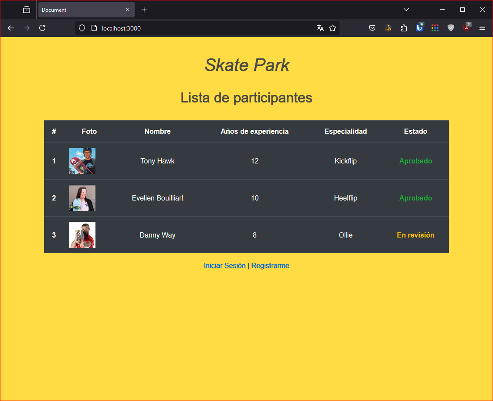

# Skate Park

## Descripción
Skate Park es una aplicación web que permite a los usuarios registrarse, iniciar sesión y gestionar su perfil. Los administradores pueden ver y gestionar a todos los usuarios registrados. La autenticación se maneja mediante JSON Web Tokens (JWT).

## Capturas de Pantalla



## Prerrequisitos o Dependencias
- Node.js (v20.11.0 o superior)
- PostgreSQL
- npm

### Dependencias del Proyecto
- express
- express-handlebars
- body-parser
- express-fileupload
- jsonwebtoken
- bcryptjs
- pg
- dotenv

## Instalación del Proyecto
1. Clona este repositorio:
    ```bash
    git clone https://github.com/tu_usuario/skate-park.git
    ```

2. Navega al directorio del proyecto:
    ```bash
    cd skate-park
    ```

3. Instala las dependencias del proyecto:
    ```bash
    npm install
    ```

## Configuración del Proyecto
1. Crea un archivo `.env` en la raíz del proyecto y configura las variables de entorno necesarias:
    ```env
    PORT=3000
    DB_USER=tu_usuario
    DB_HOST=localhost
    DB_NAME=skatepark
    DB_PASSWORD=tu_password
    DB_PORT=5432
    JWT_SECRET=tu_secreto_jwt
    ```

2. Asegúrate de tener PostgreSQL instalado y ejecutándose. Crea una base de datos llamada `skatepark`.

3. Carga el esquema de la base de datos y los datos iniciales:
    ```bash
    psql -U tu_usuario -d skatepark -f plataforma_aprendizaje.sql
    psql -U tu_usuario -d skatepark -f seed_data.sql
    ```

## Comandos para Ejecutar el Proyecto
- Para iniciar el servidor:
    ```bash
    node server.js
    ```

## Credenciales de Acceso
- Administrador:
    - **Email:** admin@skatepark.com
    - **Contraseña:** admin123
- Usuario Estudiante:
    - **Email:** user@skatepark.com
    - **Contraseña:** user123

## Estructura del Proyecto
```bash
skate-park/
│
├── public/
│   ├── css/
│   ├── js/
│   ├── uploads/
│   └── screenshots/
│
├── views/
│   ├── index.hbs
│   ├── registro.hbs
│   ├── login.hbs
│   ├── datos.hbs
│   └── admin.hbs
│
├── server.js
├── .env
├── plataforma_aprendizaje.sql
├── seed_data.sql
└── README.md
